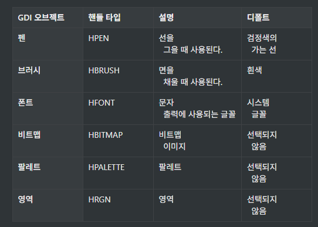
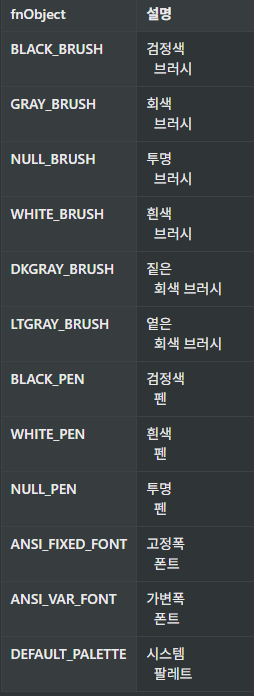
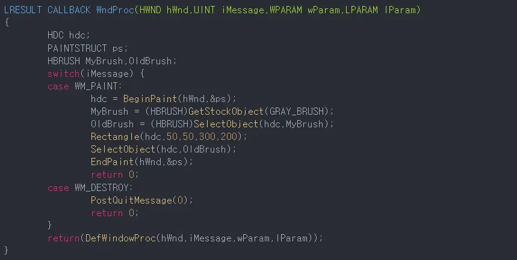
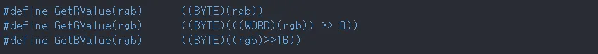
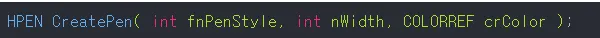
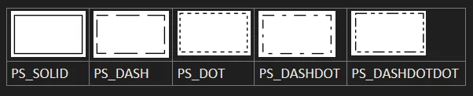
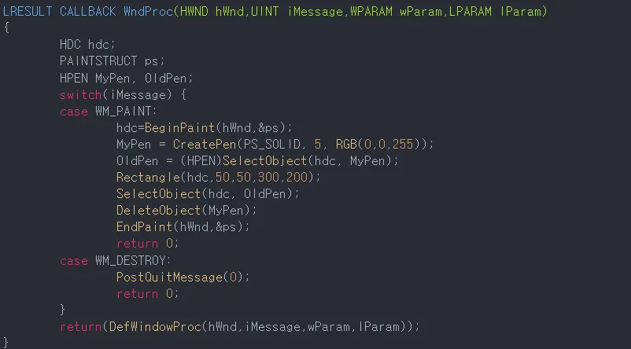
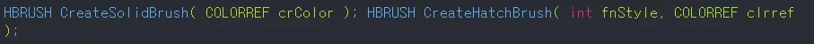
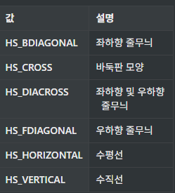
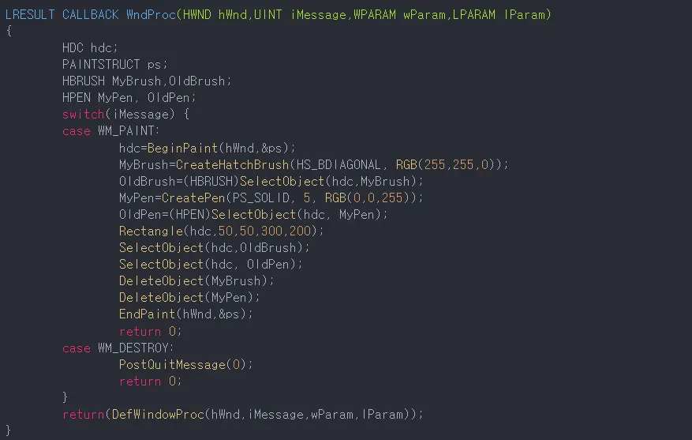

- 윈도우는 3가지 동적 연결 라이브러리(dll)로 이루어져 있음
- 1. 메모리 관리 및 실행하는 Kernal
- 2. 유저 인터페이스 및 윈도우 관리하는 USER
- 3. 화면 처리와 그래픽 담당하는 GDI(Graphic Device Interface)
 
 
 

- 따라서 출력을 하려면 GDI 모듈을 이용해야함. 화면에 출력되는 모든 글자, 그림은 GDI를 통해야 함.
- DC(Device Context) : 출력에 필요한 모든 정보를 가지는 데이터.
- DC는 구조체이며, GDI모듈에 의해 관리됨
 
 

- DC가 필요한 이유
- 화면에 선을 긋는 LineTo라는 함수
- 선 긋기 위해선 시작점, 끝점이 필요
- 추가로, 선 굵기, 색, 모양 등이 필요할 것임
- 이 모든 정보를 인자로 넘기기엔 너무 양이 많으므로, 이 정보들을 모두 모은 구조체 DC의 Handle을 넘기는 식으로 사용됨
- ->LineTo(hdc,x,y)

---

### GDI 오브젝트
- GDI 오브젝트란 그래픽 출력에 사용되는 도구를 말하며 펜, 브러시, 비트맵, 폰트 등등이 모두 GDI오브젝트임
- 사람이 그림 그릴 때 연필, 붓 등의 도구를 사용하는 것처럼 GDI가 그래픽을 출력할 때는 GDI오브젝트를 사용. 즉 선을 그을 때는 펜을 사용하며, 면을 채울 때는 브러시를 사용.
  
 
  
- GDI 오브젝트 만을 모아놓은 것이 DC이며, GDI는 현재 DC에 선택된 GDI오브젝트를 사용.
- 사용자는 그래픽 출력 전, DC에 원하는 오브젝트를 선택하여 그래픽을 다른 모양으로 변경할 수 있음
- 예로, 그냥 선 그으면 Default인 검정색 펜으로 가려지나, 파란색 펜을 DC에 선택한 후 선을 그으면, GDI는 파란색 펜으로 선을 긋게 됨.

 
  
- GDI 오브젝트는 내부적으로 구조체이나, 사용자가 쓸 때는 모두 Handle로 관리됨. GDI 오브젝트 생성시 핸들을 발급받으며, 선택 또는 삭제시에는 이 핸들만 가지고 GDI오브젝트를 사용함. 
- DC가 BeginPaint 또는 GetDC함수에 의해 처음 만들어졌을때, Default로 선택된 GDI 오브젝트는 다음과 같음.
- 

---
### 스톡 오브젝트(stock Object)
- 윈도우즈가 기본적으로 제공하는 GDI오브젝트
- OS가 제공해주므로, 일부러 만들지 않아도 됨. 사용 이후 파괴할 필요도 없음
- 다음 함수로 Handle을 얻어 사용하기만 하면 됨 
- __HGDIOBJ GetStockObject(int fnObject)__    
 
- fnObject인수에 사용하고자 하는 스톡 오브젝트를 넣어주면 됨
- 사용 가능한 스톡 오브젝트는 다음과 같음.
- 주로 브러시와 펜이 주로 제공됨
- 
- 
---
### 색상
- dos에서는 WHITE, YELLOW, RED등의 매크로 상수로 색을 표현했고, 매크로들의 실제 값은 0~15까지의 정수였음
- 윈도우즈에서는 색상값 표현하기 위해 COLORREF라는 데이터형 사용하는데, 다음과 같이 정의됨
-
- 상위 8비틑 사용 안함. 각 색상 요소는 1Byte의 크기를 가져, 0~255로 표현됨
- COLORREF는 32비트 정수형이므로, 16진수로도 표현 가능. 0xff는 빨강, 0xff0000은 파랑 등.
- RGB(r,g,b) 함수로 만들어내면 됨. COLORREF형의 인수 자리에는 RGB매크로 쓰면 됨  
 

- 다음 함수는 COLORREF형 변숙밧에서 각 색 요소의 농도 분리해내는 함수
- 

---
### 펜
- 선을 그을 때 사용되는 GDI 오브젝트.
- 펜 변경 시 선 모양 변경 가능
- 윈도우즈가 제공하는 스톡 펜은 흰, 검, 투명 3개 뿐이며, 노랑 파랑 처럼 원색의 펜은 없으므로 직접 만들어 써야함
- 다음 함수를 이용
- 
#### fnPenStyle
- 그려질 펜의 모양을 정의. 실선, 점선, 쇄선 등등
- 

#### nWidth
- 선의 폭을 지정. Default는 1이나, 3 해주면 더 두꺼워짐. 0일경우 무조건 1픽셀 두께의 선이 만들어짐

#### crColor
- 선의 색상을 지정.
- COLORREF 형이므로, RGB매크로 함수 이용
- 리턴값으로 만들어진 펜의 핸들을 돌려주므로, 이 값을 보관하여 나중에 돌려놓을 수 있음
- 
- GDI오브젝트도 메모리를 사용하므로, 사용 후 반드시 삭제해야함

### 삭제
- 삭제하고자 하는 GDI 오브젝트의 핸들을 인수로 다음 함수에 넘겨주면 됨
- __DeleteObject(HGDIOBJ hObject);
- 이때, 현재 DC에 선택돼있는 GDI 오브젝트는 삭제할 수 없음.
- 현재 사용되고 있는 객체를 함부로 삭제시킬 수 없는데, DC에 선택된 객체를 해제해주는 함수가 없으므로, 다른 GDI 오브젝트를 선택해 주어야함.

- 여기서, OldPen이 DC에 선택되면, 이전 MyPen이 선택해제되므로, 삭제가능

---
### 브러시
- 브러시는 채워지는 면을 채색하는 용도로 사용됨.
- 사각형 안쪽이나, 원의 내부 등을 채색 할 때 DC에 선택된 브러시가 사용됨.
- 스톡 브러시에는 회색, 흰색, 검정색 등의 단색 브러시가 있음.

- 첫번째 함수는 단색 브러시만 만들 수 있으며, 색만 인수로 전달하면 됨
- 두번째 함수는 색상 및 무늬 정할 수 있음. 지정가능한 무늬 종류는 다음과 같음

- 두 함수 모두 리턴값은 만들어진 브러시의 핸들임
- 예시
- 