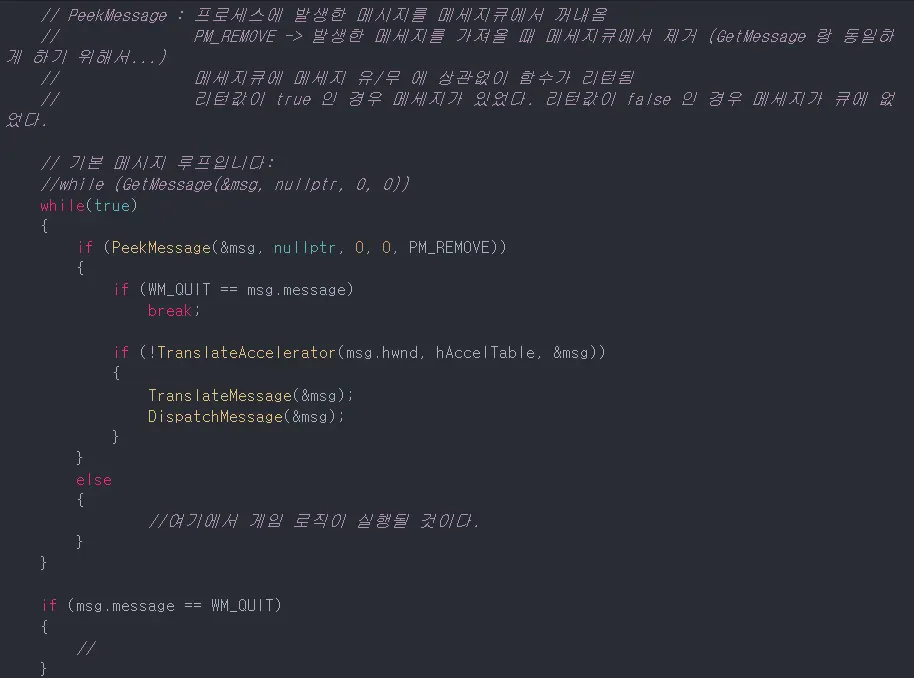

## 정적 라이브러리

### 라이브러리란?
- 소프트웨어를 만들 떄 쓰이는 클래스나 함수 등의 코드 덩어리
- 라이브러리는 다른 프로그램들과 링크되기 위하여 존재하는, 하나 이상의 서브루틴이나 함수들의 집합.
- Linking 될 수 있도록 보통 컴파일된 형태인 Object Code 형태로 존재함.
- 미리 컴파일되어 있기에 컴파일 시간도 단축할 수 있음

### 라이브러리 사용 목적
- 코드 재사용 
- 범용적 사용 가능.    
 
- 라이브러리들은 사용자 프로그램과 링크되어, 실행 가능한 온전한 프로그램을 이룸

### 라이브러리 종류
- 동적 라이브러리 : 완성된 프로그램을 실행할 때(런타임에서), 포함시키는 동적 라이브러리 (.dll)
- 정적 라이브러리 : 프로그램 컴파일 과정에서 포함시키는 오브젝트 파일들의 모임(.lib)
- 

### 정적 라이브러리
 - 프로그램 빌드 시, 라이브러리가 제공하는 코드를 실행파일에 넣는 방식의 라이브러리(복붙)
 - 컴파일의 링킹 단계에서 실행파일이 결합됨.
 - 특정 기능의 라이브러리를 static하게 만든다는 것은 컴파일의 linking 단계서 .lib파일을 실행 binary에 포함 시킨다는 이야기.
 - 즉, lib의 동작 코드가 이를 사용하는 파일 속에 포함되어 있기 때문에, 별도의 추가작업 없이 독립적으로 라이브러리 함수들을 사용 가능
 - 실행 파일에 포함되어 있기 때문에, 실행시 라이브러리가 없어도 됨

#### 장점
- 시스템 환경이 변해도 어플리케이션에 아무런 영향없음. 완성된 어플을 안정적으로 사용 가능
- 컴파일시 필요한 라이브러리를 프로그램 내에 적재하므로 이식성(HW 독립적)이 좋다.
- 런타임시 외부를 참조할 필요 없기에 __속도가 빠름__(미세하게)

#### 단점
- 같은 코드를 가진 프로그램이 실행될 경우가 있으면 코드가 중복될 수 있음. 따라서 메모리 낭비 발생
- 라이브러리 변경시, 모든 프로그램 재배포 필요

### 동적 라이브러리
- DLL을 구현하고 컴파일하면 정적 라이브러리와는 다르게 2개의 파일이 생성됨
- .lib, .dll 파일
- 여기서 lib파일은 정적라이브러리의 lib파일과 완전히 다름
- 정적 라이브러리의 lib파일은 라이브러리 전체 코드를 포함하는 binary파일.
- DLL의 lib파일은 dll이 제공하고자 하는 함수 정보(이름)을 가지는 정보 파일.
- 프로그램 시작 시 같이 로딩되며, 프로그램 종료시 메모리에서 해제되는 방법으로 암시적 링킹(Implicit Linking)이라 함.
- 프로그램 실행 시 필요하면 dll파일에서 함수를 참조함.
- 즉, lib파일은 링킹시 필요, dll파일은 실행시 필요

#### 장점
- 메모리 절약, 스와핑 줄임(메모리 공간 부족시, 당장 필요없는 데이터를 보조기억장치로 옮겼다가 나중에 가져오는 기술)
- 보다 쉽게 업그레이드 가능
- 서로다른 프로그래밍 언어로 작성된 프로그램도, 함수 호출 규약만 잘 따르면 동일한 DLL함수를 호출할 수 있음
- 프로그램 변경 시 변경된 부분의 공유 라이브러리만 재배포하면 되므로, 유지보수가 쉬움

#### 단점
- 외부 의존도가 높기 때문에 이식성이 떨어짐.
- 공유 라이브러리를 메모리에 올릴 때, 찾고 올릴때 시간 걸리므로 성능저하가 발생

---

### 메세지 기반 프로그램의 단점
- 메세지 기반 프로그램은 특정 메세지(이벤트)가 있을 때만 특정코드가 동작함.
- 일반적인 응용프로그램에선 상관 없으나, 게임은 플레이어가 멈춰있어도 몬스터는 움직여줘야 하는 상황이 많으므로, GetMessage함수를 통한 메세지 기반으로 게임을 만들기엔 적절치 않음.
- winAPI에서는 SetTimer()함수를 통한 초단위 기반으로 메세지를 처리해줄 수 있으나, 비효율적임.
- 게임처럼 돌아가기 위해 GetMessage가 아닌 매 프레임마다 메세지 확인할 수 있는 PeekMessage를 사용함.
- PeekMessage는 마지막 인자로 PM_REMOVE를 넣어줘야 메세지큐에서 메세지를 삭제해줌
