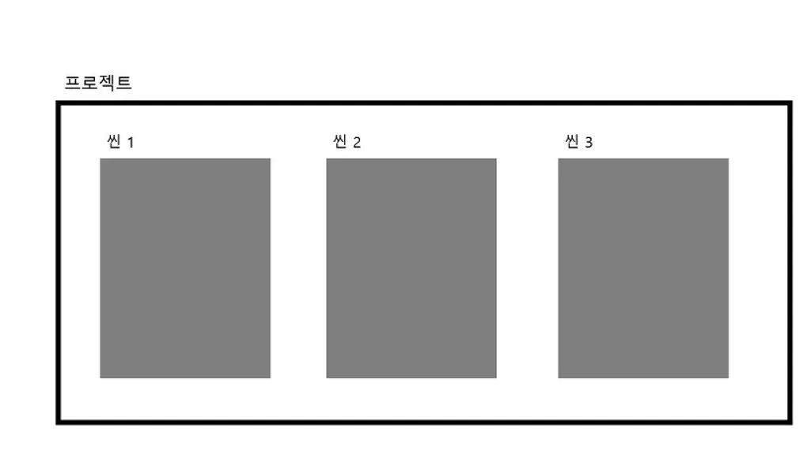
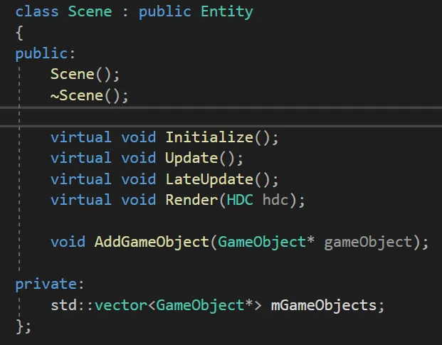
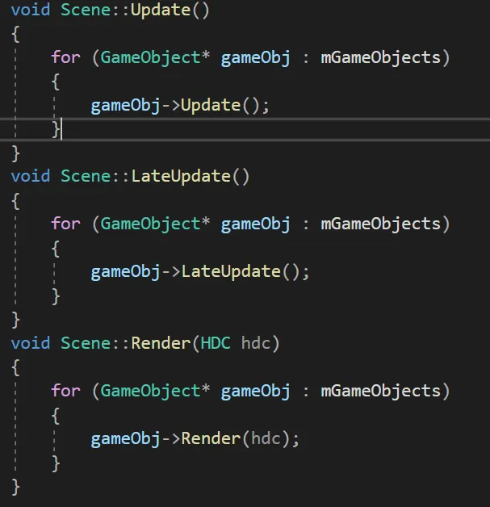
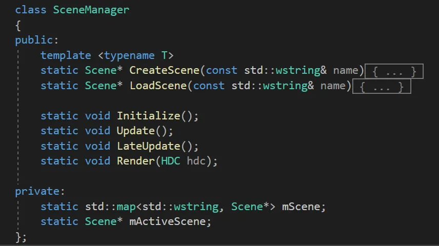

SceneManager
===============

Scene
-----
- 씬 안에는 오브젝트가 포함되어 있음.
- 씬을 사용하여 메인메뉴, 각 레벨 및 기타 등등을 만들 수 있음
- 하나의 씬 파일은 한 레벨로 취급됨
- 각 씬에서는 환경, 장애물, 장식 등이 배치됨

----------

- Scene은 GameObject들을 가지고 있으며, 내부적으로 각 게임오브젝트들의 Update(), Render()를 돌려준다

SceneManager
-------------
- 각각의 Scene을 관리해주는 SceneManager클래스가 존재함.
- Scene이 여러개가 있을 수 있기 때문에 Scene들을 관리하고 변경하는 등 여러가지 Scene에 관련된 작업을 해주는 클래스
- Scene과 Scene을 넘나드는 작업을 할 때 주로 이용
- ex, 로딩이 끝나면 타이틀씬으로 이동하고, 게임시작 누르면 게임플레이 씬으로 이동하는 등, 장면 하나하나를 단위로 게임을 구성하고, 그 장면들을 관리해주는 클래스로 생각하면 편함

------------
- 여러개의 Scene에서 원하는 Scene을 빠르게 탐색하기 위해 map(레드블랙트리)으로 관리함.
- Update중인 씬은 동시에 여러개 씬을 전부 Update하는것이 아니라, 현재 화면에 나오는 ActiveScene만 보여주면 되므로, ActiveScene을 따로 관리함.