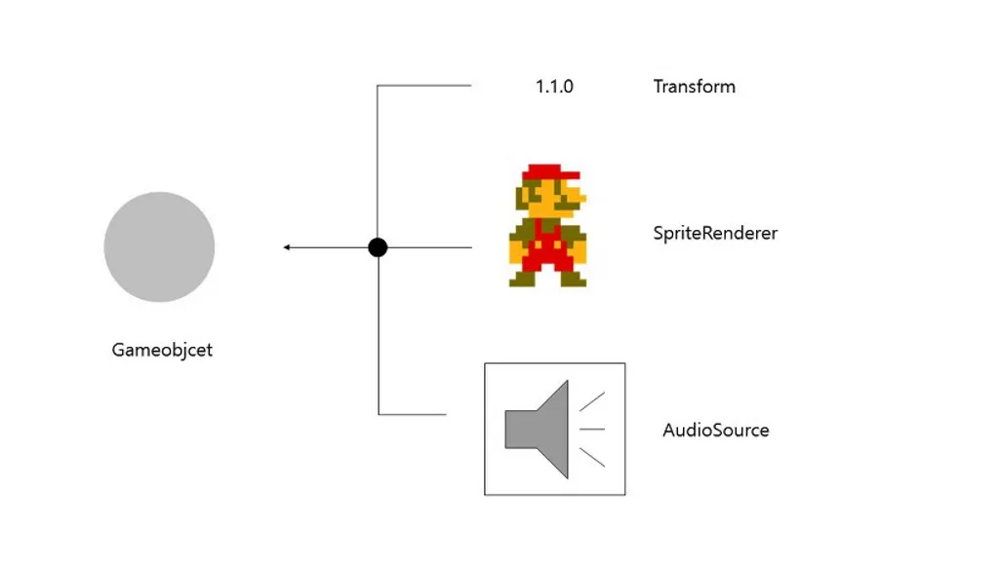
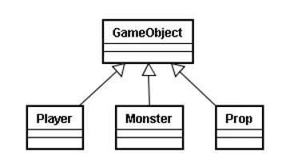
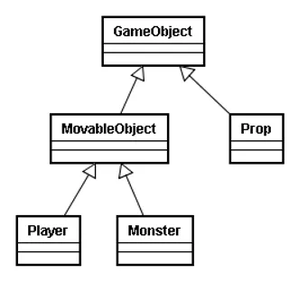
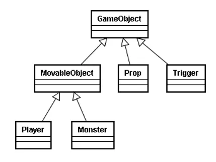
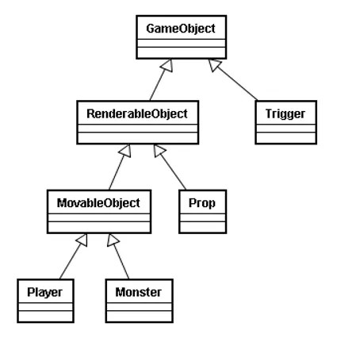
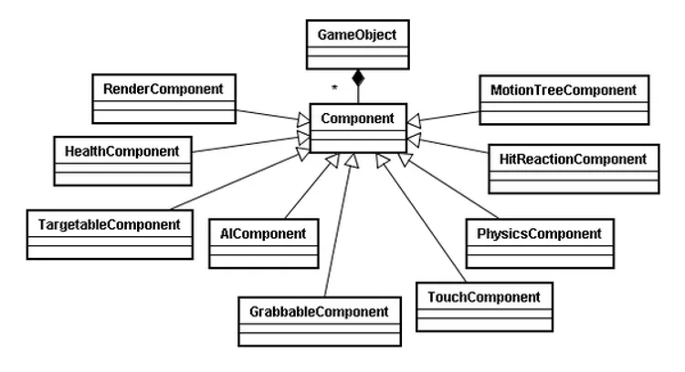
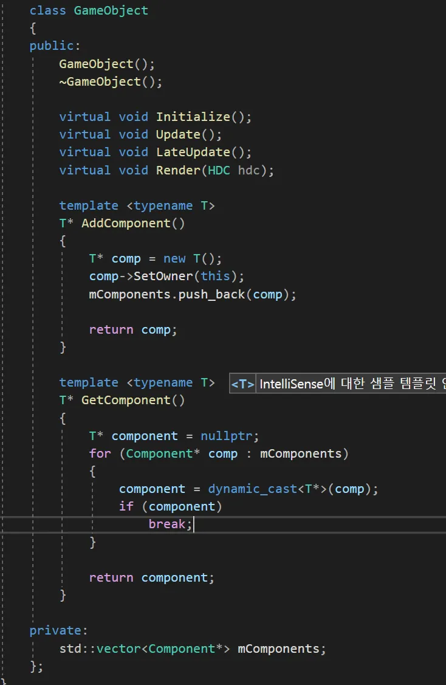
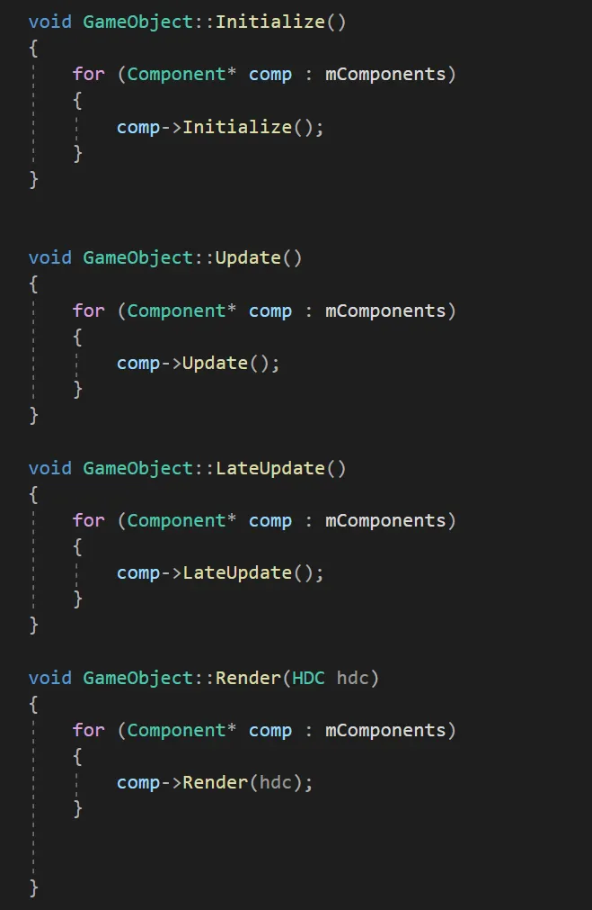
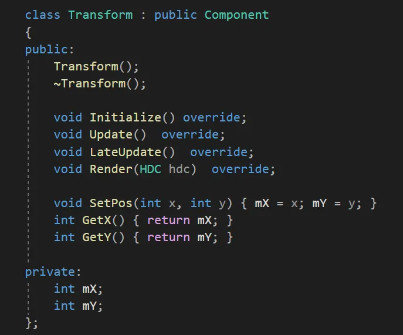

GameObject
=========
- 레벨에 배치할 수 있는 오브젝트
- 게임 오브젝트는 이동, 회전, 스케일과 같은 Transform을 지원하는 범용 클래스임
- 즉, 화면상에 존재하는 UI, 몬스터, 플레이어 등 씬을 구성하는 단위
- 이러한 게임 오브젝트 안에는 여러가지 Component들이 존재

-------
- Transform은 크기, 이동, 각도 같은 작업을 담당하며, SpriteRenderer는 화면상에 그림을 그려주는 역할을 함.
- AudioSource는 소리를 재생시켜주는 역할을 함

상속구조
-------
- 게임오브젝트를 설계시 가장 보편적인 구조는 상속을 이용한 계층 구조
- 오브젝트가 하는 기능을 중심으로 계층을 만들어 설계하는것.

- Player, Monster, Prop의 공통 부분은 GameObject에서 처리를 하고, 나머지 부분은 각각의 오브젝트에서 구현하며 실행하면 됨
 

- Plyaer와 Monster에 움직이는 계층구조 하나 추가하면,

- 움직임 관련 처리는 MovableObject에서 하면 되고, 그 외 Player, Monster에 특화된 다른 처리들을 하면 됨

- 여기에, Trigger라는 오브젝트를 추가하려함
- 그런데, Trigger는 화면에 그려지지 않는 오브젝트임. Player, Monster, Prop과는 다른 속성이 생긴것.
- 따라서 그려지는 것을 처리하는 계층을 하나 더 추가해야함

- 이런 식으로, 공통된 부분들을 묶어서 중간계층을 추가하여 설계해 나가는 방식을 게임오브젝트의 계층 구조 설계라고 함.
- 하지만 게임이 복잡해질수록 계층이 복잡해짐.
- 또한, 만든계층구조에서 각 다른 계층의 일부구조만 따로 사용하는 오브젝트가 존재할 수 있음(카메라 등)
- 이에따라, 컴포넌트구조가 등장

컴포넌트 구조
---------
- 게임 오브젝트의 컴포넌트 구조는 상속구조의 문제점을 보완하고자 제안된 설계방법
- 컴포넌트 기반 설계는 게임 오브젝트가 해야할 기능들을 각각의 벽돌의 객체에 분할하여 게임 오브젝트의 클래스 기능이 비대화 되는 문제점을 해결하는 설계

-컴포넌트기반 설계서 게임오브젝트는 각 타입에 따라 사용되는 컴포넌트들로 구성됨
- 오브젝트마다 필요한 기능이 있다면 그 기능을 하나의 컴포넌트로 만들고, 컴포넌트들을 추가하여 하나의 게임오브젝트를 구성. 게임 오브젝트는 단지 여러개의 컴포넌트들을 관리할 뿐임
- 유니티, 언리얼 모두 이용

- 오브젝트는 여러개의 컴포넌트를 가지고 있고, 각각의 컴포넌트를 순회하면서 Render와 Update함수만을 호출해주고 있음.
- 이러면 컴포넌트들을 상속받은 Animation, Collider 컴포넌트들을 가상함수를 시용하여 구현이 된 부분들이 자식객체들로 알아서 호출이 될 것임

