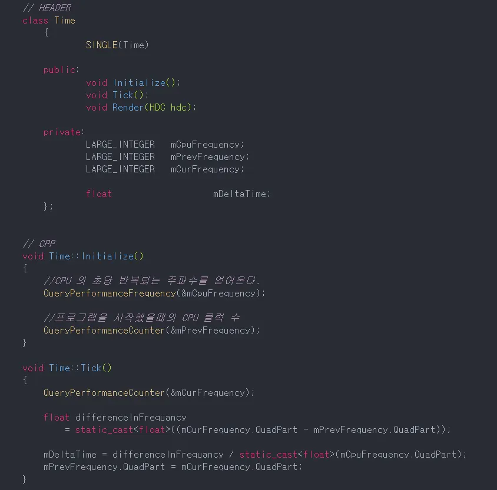
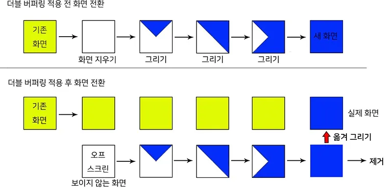
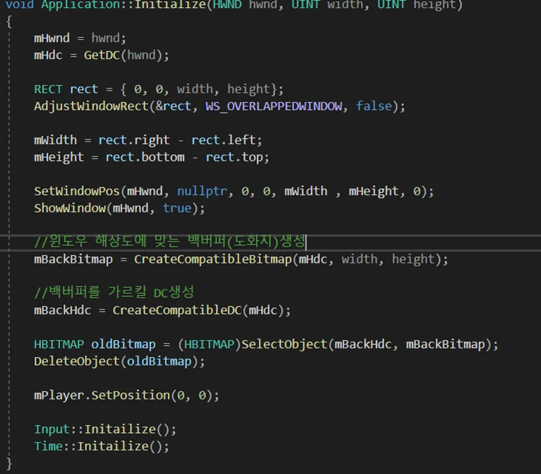
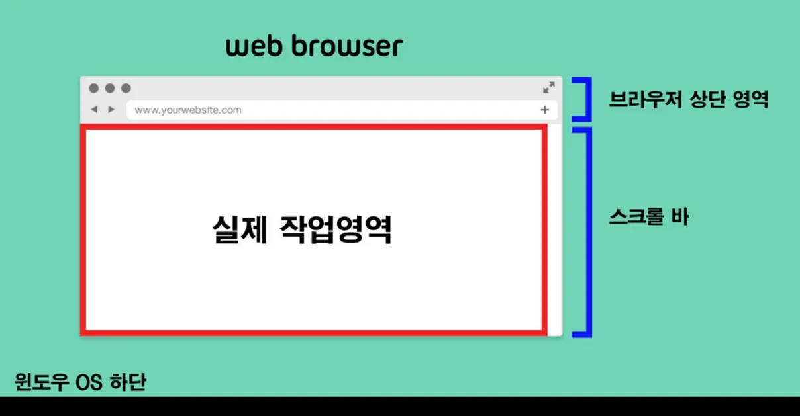

## Time
- 게임을 실행하는데 있어서, 컴퓨터 사양에 따라 프로그램 실행 속도가 다름
- 1 반복당 1m를 움직이는 코드에서, 사양이 좋은 컴퓨터라면 동일 시간동안 해당 로직을 100번 반복하여 100m 만큼 이동한다. 
- 그러나 사양이 나쁜 컴퓨터라면 해당 로직을 10번 반복하여 10m만큼 이동한다.
- 따라서 컴퓨터 사양에 관계없이 동일하게 실행될 수 있도록 해야함

 
  
  - 따라서 직전 프레임과 현재 프레임 사이 간격(DeltaTime)을 곱해주어, 어느 컴퓨터에서든 초당 이동거리가 같도록 해주어야함.

### DeltaTime
- DeltaTime을 구하기 위해선 2가지 윈도우 함수 이용해야함
- QueryPerformanceFrequency 함수는 초당 CPU의 고유 진동수(Hz) 가져옴
- 그러나, 윈도우10부터는 고유 진동수가 아닌 10,000,000라는 숫자를 고정으로 가져옴
- QueryPerformanceCount함수는 프로그램이 실행하는 동안 얼마만큼의 진동수가 지나갔는지를 측정해줌
- 프로그램이 끝났을 때 걸린 진동수에서 프로그램이 처음 시작했을때 측정한 진동수를 빼주고, CPU의 고유 진동수로 나눠주면 DelTaTime이 구해짐

## Double Buffering
- 현 프레임워크에는 하나의 문제점지 존재.
- 비트맵 배경 이미지를 그리는 작업은 그림을 읽는 작업에 비해 훨씬 느림.
- 또한 실시간으로 지우고, 그리고, 다시 지우고, 다시그리고를 반복하면 깜빡거림 현상이 일어나게 됨
- 이러한 Flicking현상을 해결하기 위해 더블 버퍼링을 사용

#### DC를 하나 더 생성하여 화면엔 보이지 않는 BackBuffer를 만든 후, 먼저 buffer에 배경을 칠한다음 그림. 한 프레임마다 화면에 보이는 원래 윈도우에 덮어써줌으로써, 깜빡거림 없앰

 

- 새로운 HDC와 배경인 BITMAP을 만듬

 

- 그러나 실제 윈도우 크기와 실제 작업영역은 다름

  

  - 우리가 생성한 윈도우 영역은 브라우저 상단영역을 포함한 전체영역을 기준으로 크기를 정하여 윈도우창을 만듬.
  - AdjsutWindowRect함수를 이용하면 실제 작업영역의 크기를 지정해줄 수 있음.
  - Backbuffer에 물체를 그려준 후, 원래 Buffer에 복사해서 한번에 그릴수 있게 됐으니 더블버퍼링 적용시킬 수 있음
