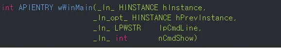
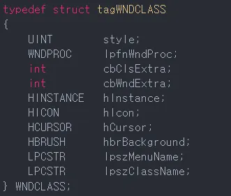
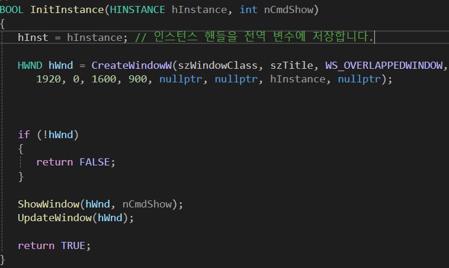
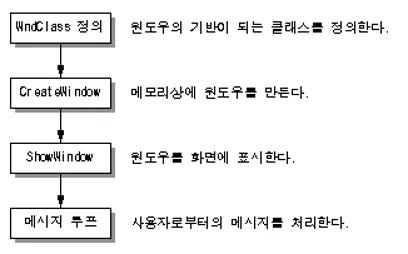

- Windows에서는 "windos.h"라는 하나의 헤더 파일에 모든 API 함수들의 원형 및, 상수들을 정의해놓음. 따라서 대부분 Windows프로그램 첫 줄은 include <windows.h>로 시작함

### 프로그램 시작점

- dos 프로그램은 entry point가 Main함수이나, 여긴 WinMain가 entry point임
- wWinMain은 4개의 인수를 취하는데, 각 인수의 의미는 다음과 같음

| 인수            |                                          의미                                          |
| :------------ | :----------------------------------------------------------------------------------: |
| hInstance     |                              프로그램의 인스턴스 핸들(program ID)                               |
| hPrevInstance | 바로 앞에 실행된 현재 프로그램의 인스턴스 Handle. 없을땐 NULL이며,     __WIN32에서는 항상 NULL__이다. 호환성을 위해서만 존재 |
| IpCmdLine     |                         명령행으로 입력된 프로그램 인수. dos의 argv 인수에 해당                          |
| nCmdShow      |                           프로그램이 실행될 형태이며 최소화, 보통모양 등이 전달됨                            |
- 이 중 hInstance외엔 잘 사용 안됨(Instance : 클래스가 실제 메모리에 올라가 있는 객체)

- 위 사진은 같은 메모장이나, OS는 각각 다른 메모리를 사용하는 Prgram으로 인식함.
- 이 때 각 메모장은 서로 다른 Instance Handle을 가지며, OS는 이 Instance Handle값으로 구별.
- hInstance : 프로그램 자체를 가리키는 정수값.
- +IpszClass라는 전역 문자열이 정의되어 있는데, 이것은 윈도우 클래스를 정의하는데 사용

### 메세지 처리 함수

- 이 프로그램은 크게 2개의 함수만 있음. 하나는 프로그램의 시작점인 __wWinMain__이고, 다른 하나는 __WndProc__임.
- dos에서는 main함수만으로 program 작성 가능하나, Windows에서는 일반적으로 두 함수 모두 존재해야함.
### wWinMain에서는 윈도우를 만들고 화면에 출력하기만 할 뿐, 대부분의 일은 WndProc에서 이루어짐.

- 따라서 wWinMain은 일반적으로 항상 일정한 코드로 돼있으나, wndProc은 프로그램에 따라 다름. proc을 자세히 봐야함

## 윈도우 클래스
- 윈도우 클래스는 만들어질 윈도우의 여러가지 특성을 정의

### style
- 윈도우의 스타일을 정의. 윈도우가 어떤 형태를 가질 것인가를 지정하는 멤버.
- 많은 값을 가질 수 있으나, CS_HREDRAW와 CS_VREDRAW가 가장 많이 사용됨.
- OR 연산자(|)로 연결하여 사용. 이 값들의 의미는 윈도우의 수직 또는 수평 크기가 변할 경우, 윈도우를 다시 그린다는 뜻
  
  ### IpfnWndProc !!중요!!
  - 윈도우의 메세지 처리 함수를 담당.
  - 메세지 발생할 때마다 여기서 지정한 함수 호출되며, 이 함수가 모든 메세지를 처리함.
  - 메세지 처리 함수는 커스텀 가능하나, 보통 WndProc으로 쓰는게 좋음

### cbClsExtra, cbWndExtra
- 일종의 예약 영역. Windows가 내부적으로 사용하며, 특수 목적 외 사용 안함
- 사용 안할경우  0으로 지정

### hInstance !!중요!!
- 이 윈도우 클래스를 사용하는 프로그램의 번호이며, 이 값은 WinMain의 인수로 전달된 hInstance값과 같음
  
### hIcon, hCursor
- 이 윈도우가 사용할 마우스 커서와, 창이 최소화됐을 경우 출력될 아이콘 지정.
- LoadCursor함수와 LoadIcon함수를 사용하여 지정. 사용자가 직접 아이콘과 커서를 만들어 쓸 수도 있음
  
  ### hbrBackground
  - 윈도우의 배경 색상 지정
  - 정확히는 윈도우의 배경 색을 채색할 브러시를 지정
  - GetStockObject 함수 사용해 윈도우의 built-in 브러시를 지정
  - 보통 WHITE_BRUSH가 제일 많이 사용됨

### IpszMenuName
- 이 프로그램이 사용할 메뉴 지정.
- 메뉴는 프로그램 코드에서 만드는 것이 아닌, 리소스 에디터에 의해 별도로 만들어진 후 링크시에 같이 합쳐짐
- 메뉴 사용 안할 때는 NULL

### IpszClassName !!중요!!
- 윈도우 클래스의 이름을 정의.
- 여기서 지정한 이름은 CreateWindow 함수에 전달되며, 이 함수는 윈도우 클래스에서 정의한 특성값을 참조하여 윈도우 생성
- 윈도우 클래스의 이름은 보통 실행 파일과 일치시킴

- RegisterClass 함수의 인수로 wcex 구조체의 주소를 넘기면 됨
- 이런 특성을 가진 윈도우를 사용하겠다는 등록 과정. 램에 올리겠다는거임
- 이후 등록된 윈도우로 윈도우 생성해야함

### CreateWindowW 함수
- 첫번째 인자 : 생성하고자 하는 윈도우의 클래스를 지정하는 문자열. 앞에서 지정한 Wndcex의 IpszClassName넣으면 됨
- 2번째 인자 : 윈도우의 타이틀 바에 나타날 문자열
- 3번째 인자 : dwstyle. 만들고자 하는 윈도우의 형태를 지정하는 인수. 일종의 비트필드 값이며, 매크로상수들을 |연산자로 연결해 윈도우의 형태 지정.

- 이후 인자들 : X,Y,nWidth,nHeight : 윈도우의 위치와 크기. 픽셀 단위로 지정
- hWndParent : 부모 윈도우가 있으면 핸들 지정, 없으면 NULL
- hmenu : 메뉴 핸들. 사용 안하거나 클래스에서 지정한 메뉴 그대로 쓴다면 NULL
- hinst : 프로그램 인스턴스 핸들. hInstance임
- IpvParam : 특수목적 포인터. 보통 NULL

## 윈도우 화면 출력과정
- CreateWindow함수는 메모리에 윈도우를 만들 뿐, 화면에 띄우진 않음.
- 화면에 띄우려면 ShowWindow 필요
- 함수원형 : BOOL ShowWindow(hWnd,nCmdShow);
- hWnd : CreateWindow가 리턴한 윈도우 핸들
- nCmdShow : 윈도우를 보여주는 방법 지정(SW_HIDE : 숨기기, SW_MINIMIZE : 최소화, SW_SHOW : 활성화 등). 보통 인자로받은거 걍 씀

## GDI(Graphic Device Interface)와 DC(Device Context)
- 윈도우를 화면에 띄운 후, 글자나 그림을 그리기 위한 핵심 개념
- GDI : 화면 처리와 그래픽을 담당하는 Windows 모듈
- DC : 출력에 필요한 모든정보(폰트,선 색, 굵기 등)를 담고 있는 데이터 구조체. GDI모듈에 의해 관리됨

- DC필요 이유 : 여러 프로그램 동시 실행 시, 내가 그리는 그림이 내 윈도우 영역에만 그려지도록 관리하는 역할도 DC가 함
  

# 정형화된 과정

- 윈도우는 3가지 동적 연결 라이브러리(dll)로 이루어짐
- 1. 메모리 관리 및 실행시키는 kernal
- 2. 유저 인터페이스 및 윈도우 관리하는 user
- 3. 화면 처리 및 그래픽 담당하는 GDI

- 따라서 화면에 출력하려면 GDI에 관심 가져야함