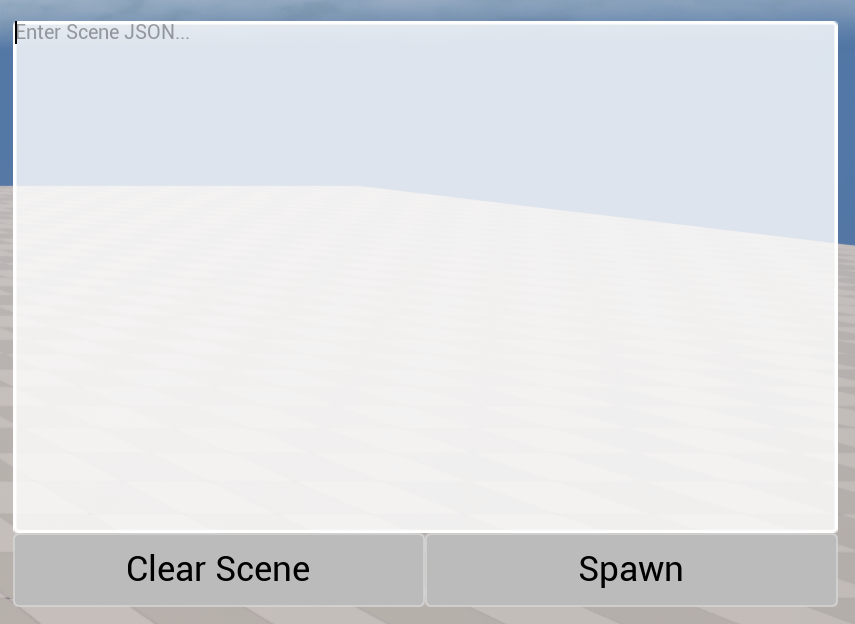
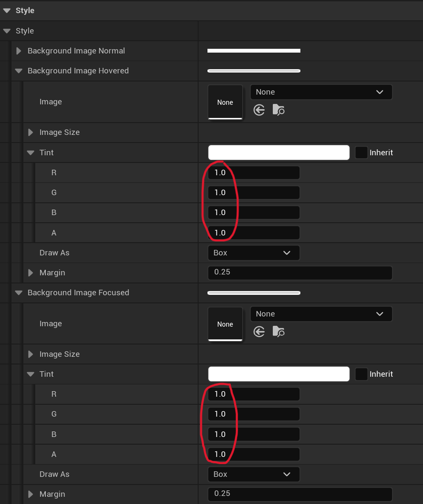
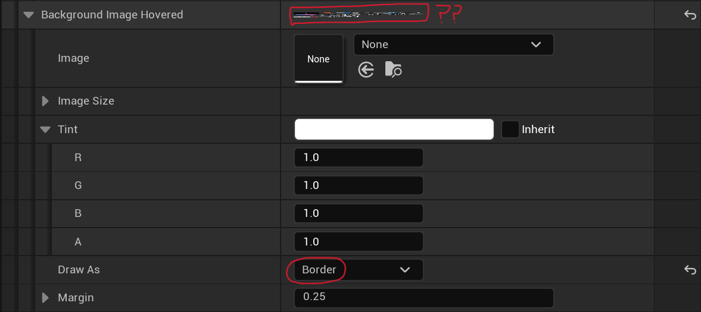
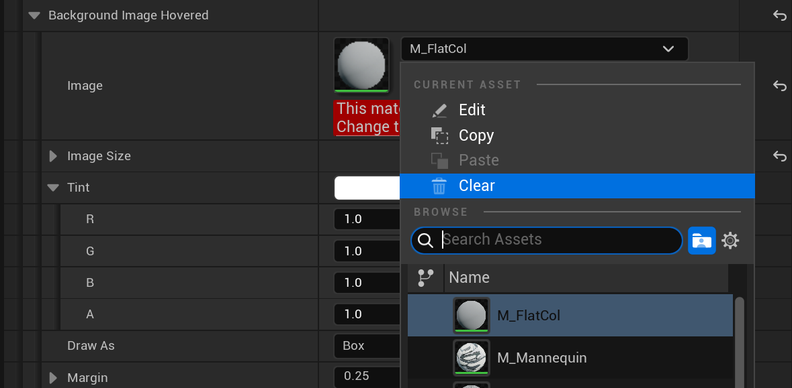

# 언리얼 간단한 메모들

## 네비게이션

- 네비게이션이 작동하게 하고 싶은 구간에 `NavMeshBoundsVolume`을 설치해줘야 한다
- `NavLinkProxy`라는 것을 설치해주면 내비메시에서 단절된 구간을 이동하게 할 수 있다.
- 단차가 있는 곳을 돌아가는 것이 아닌 뛰어내리게 하는 것이 가능
- [NavLinkProxy 설명](https://dev.epicgames.com/documentation/ko-kr/unreal-engine/1.2---nav-link-proxy?application_version=4.27)

## UV

- [UV와 텍스쳐의 배치](https://wdnote.tistory.com/210)

<br>

## 메인 UI는 어떻게 만들어야 하는가

PlayerController에서 위젯을 직접 생성

```c++
void AMyPlayerController::BeginPlay()
{
    Super::BeginPlay();

    if (MainUIClass)
    {
        MainUIWidget = CreateWidget<UUserWidget>(this, MainUIClass);
        MainUIWidget->AddToViewport();
    }
}
```

이때 `AddToViewport(100)` 처럼 zorder를 넣어줄 수 있음. 숫자가 클수록 더 위에 그려짐 (hit test 먼저 받음)

UI 2개가 같은 zorder를 가지면 hit test를 받지 않는 레이아웃 위젯이더라도 다른 UI의 hit를 막아버림 (표준인지는 모르겠음. 우연히 알아낸 결과) zorder가 다르면 괜찮음. 

> 둘 다 hit를 받는 위젯이면 당연히 하나만 hit됨. hit되지 않는 위젯과 hit되는 위젯이 만나도 zorder가 같으면 둘 다 hit가 안되는 경우가 있다는 것

#### PlayerController에서 생성하는 이유?

위젯을 생성할때 Owner를 지정하게 되는데, PlayerController가 소유하는 것이 가장 자연스러움. (각 클라이언트에 하나씩 존재하기 때문)

Owner가 파괴되면 위젯도 파괴됨. 일반 엑터에 부착하면 라이프사이클 불일치

상황|추천 방식
--|--
메인 HUD, 인벤토리, 메뉴|PlayerController에서 UMG Widget
월드 공간 UI (체력바 등) |WidgetComponent (Actor에 부착)
여러 UI 관리가 복잡해질 때|UI Manager 서브시스템 별도 구성
레거시/디버그 드로잉|AHUD

<br>

## StaticMeshComponent의 Mobility 

Mobility|의미
--|--
Static|게임 실행 중 이동/변경 불가. 라이팅 베이크 대상
Stationary|위치는 고정, 일부 속성 변경 가능
Movable|런타임에서 자유롭게 변경 가능

StaticMeshComponent의 기본값은 Static임. 이 때문에 AStaticMeshActor를 생성하고, SetStaticMesh 함수를 사용해도 경고가 뜨고 메시가 설정되지 않음

```c++
Actor->GetStaticMeshComponent()->SetMobility(EComponentMobility::Movable);
Actor->GetStaticMeshComponent()->SetStaticMesh(CubeMesh);
```

SetMobility를 하고 메시를 설정한다는게 뭔가 불편해보이지만, 기본값이 static이라 어쩔 수 없는 것이고, 런타임에 동적으로 생성되는 액터는 라이팅 베이크 대상이 아니라서 Movable로 쓰는 것이 옳은 용법임

<br>

## ConstructorHelpers vs LoadObject


### ConstructorHelpers: 
클래스 생성 시점에 에셋을 미리 고정으로 불러오기

- 사용 위치: C++ 생성자에서만
- 대표 함수: ConstructorHelpers::FObjectFinder, FClassFinder
- 특징:
    - 컴파일 시점에 경로가 거의 고정됨
    - 에디터에서 경로 잘못되면 바로 에러/크래시
    - 주로 디폴트 메쉬, 머티리얼, 클래스 설정용

### LoadObject: 
런타임에 필요할 때 동적으로 에셋 불러오기

- 사용 위치: 어디서든 가능 (BeginPlay, 함수 등)
- 대표 함수: LoadObject\<T>()
- 특징:
    - 문자열 경로로 런타임 로딩
    - 실패해도 게임 안 죽고 nullptr 반환
    - 상황에 따라 다른 에셋 로딩 가능
    - 약간 더 느림

<br>

## Level Instances vs Packed Level Actor

### Level Instances:
엑터 배치를 편하게 해주는 언리얼의 프리팹

- 대부분의 에셋을 결합할 수 있음
- 레벨 인스턴스를 구성하는 각 객체가 그대로 배치됨 (최적화 없음)
- 유니티의 프리팹에 가장 가까움

### Packed Level Actor:
렌더링에 최적화된 Level Instances의 특수 형태

- 스태틱 메시만 결합 가능
- [Instanced Static Mesh](https://dev.epicgames.com/documentation/unreal-engine/instanced-static-mesh-component-in-unreal-engine) 라는 컴포넌트를 사용해 렌더링을 최적화함
- ISM은 원래 있는 기능인데, 이를 레벨 인스턴스와 합쳐 사용하기 쉽게 만든 것이 PLA임

> [레벨 인스턴싱 참고](https://dev.epicgames.com/documentation/unreal-engine/level-instancing-in-unreal-engine)

<br>

## Rendering 설정 (r vs sg)

- 둘 다 cvar 라고 부름 (console variable)
- `r.ShadowQuality 2` 형식으로 사용함 (ini 파일에선 `r.ShadowQuality=2`)

### `r.` (Rendering 개별 옵션)

렌더링 시스템의 세부 옵션을 직접 제어하는 콘솔 변수

* 특정 기능 하나만 정밀하게 조절
* 디버깅 / 성능 최적화 시 자주 사용
* `sg.`보다 우선적으로 덮어쓰기 가능 (단, 순서 영향 있음)

#### 특징

* 매우 세밀한 제어 가능
* 옵션 단위로 독립적 변경

### `sg.` (Scalability Group 옵션)

여러 `r.` 설정을 묶어서 품질 프리셋 형태로 관리하는 변수

* Low / Medium / High / Epic 같은 그래픽 옵션과 직접 연결
* 내부적으로 여러 `r.` 값을 자동 변경

#### 특징

* 한 번에 전체 품질 조절 가능
* 유저 옵션 메뉴와 연동됨
* 빠르게 기본 세팅 잡을 때 유용

<br>

## UMG 색 설정 버그 해결법

UMG에서 UI를 만들다보면 가끔 몇몇 요소에서 아무리 색을 설정해도 내가 설정한 색으로 나오지 않을 때가 있다. 아래는 Tint Color를 완전히 흰색, 불투명으로 설정했지만 인게임에서 반투명으로 나오는 모습이다.

| 인게임 모습 (반투명) | 실제 설정 (불투명) |
|---|---|
|  |  |

이때 설정의 Draw As를 "Border"로 바꿔보면 갑자기 알 수 없는 이미지가 나온다. 크게 띄워봤을 때 언리얼에서 사용되는 아이콘들이 모여있는 텍스쳐 아틀라스로 보였다.



Image가 아무것도 선택되어 있지 않은데, 저 텍스쳐가 뜨는 이유를 알 수가 없다. 아무리 Draw As와 색상값을 바꿔도 저 텍스쳐는 사라지지 않고, 실제 UI의 색도 바뀌지 않는다.

해결법은 단순하다. Image 드롭다운에서 아무거나 선택하고, clear를 하면 진짜 "None" 상태가 된다. 다시 실행하면 색이 정상 적용 되어있다.



내가 사용하는 버전은 언리얼 5.7.4인데, 이게 현재 버전의 버그인지, UMG의 고질적인 문제인건지, 또는 오히려 내가 해결한 방법이 버그인건지 모르겠다. (기본값을 엔진단에서 고정해놨는데 그것을 뚫어버린 것일 수도 있음)
